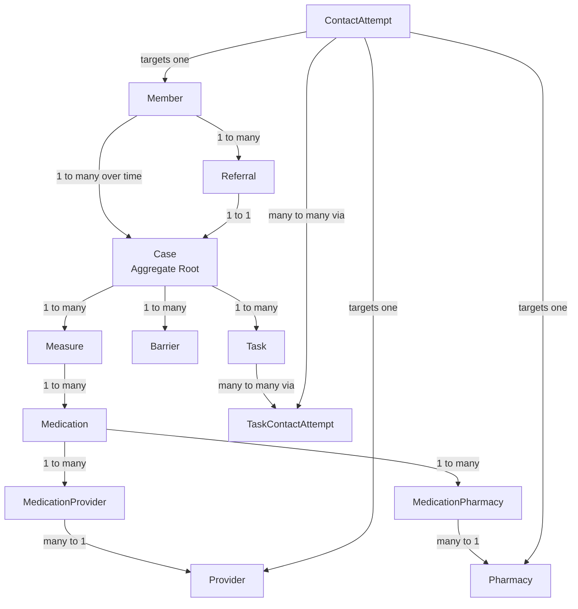
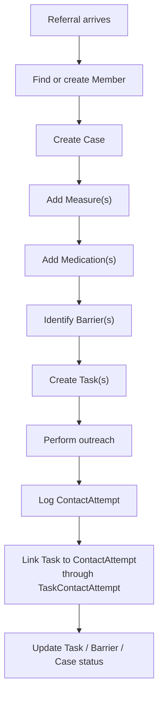

# Rescue Workflow Overview

## Metadata

Document ID: WF-RESCUE-001
Status: Active
Version: 0.1.0
Last Updated: 2026-03-11
Owner: Jose Palomino
Layer: Workflow
Parent Document: PRD-MASTER-001

---

## Purpose

This document is a working visual reference for the current rescue operations model.

It combines:

- the current domain structure
- the current high-level workflow

It is intended to support design conversations and should be updated as the model changes.

---

## Domain Structure

---

## Workflow Overview

---

## Key Modeling Notes

- `Case` is the aggregate root.
- `Referral` creates exactly one `Case`.
- `Task` is case-scoped work.
- `ContactAttempt` is the real communication event.
- `TaskContactAttempt` links work to communication when one event affects one or more tasks.
- `Provider` and `Pharmacy` are shared actors that may appear across many cases.
- `MedicationProvider` and `MedicationPharmacy` are relationship objects, not just technical join tables.

---

## Open Design Areas

- exact fields for `Measure`
- exact fields for `Medication`
- exact fields for `Provider`
- exact fields for `Pharmacy`
- exact fields for `MedicationProvider`
- exact fields for `MedicationPharmacy`
- whether any barriers need optional measure-level or medication-level references

---

## Version History

Version 0.1.0 - 2026-03-11 - Initial visual overview for the current rescue domain and workflow.
